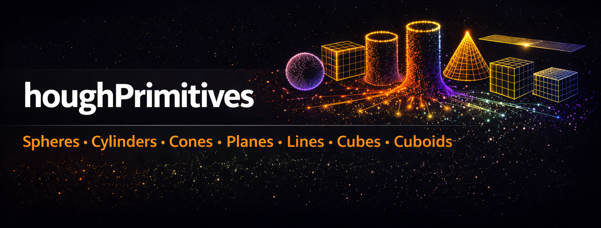
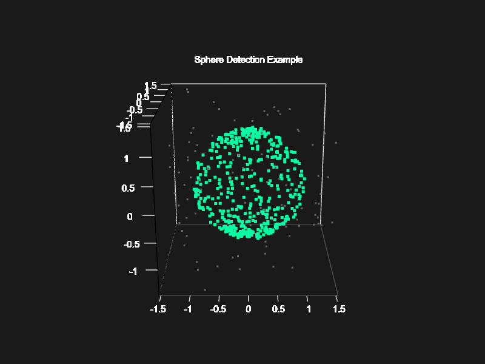
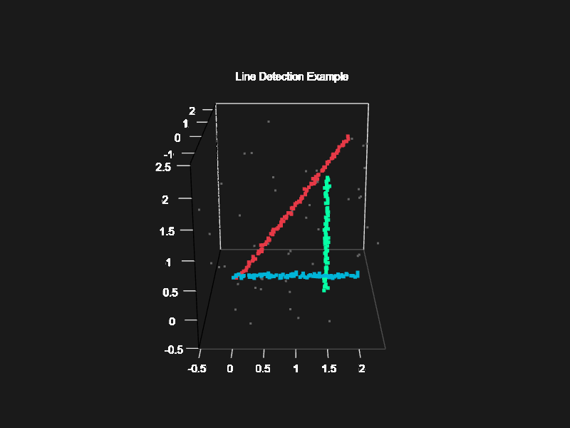
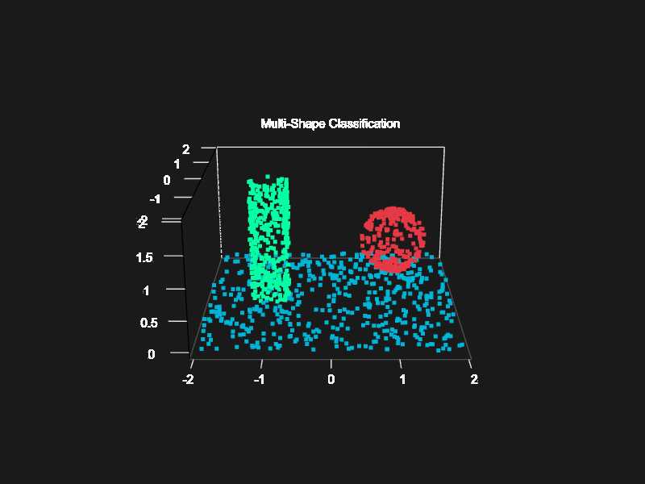

# houghPrimitives

[](https://www.r-project.org/)


Comprehensive 3D Shape Detection for LiDAR Point Clouds using Iterative
Hough Transform methods.



## Overview

`houghPrimitives` is an R package that implements advanced 3D shape
detection algorithms using Iterative Hough Transform methods. It’s
specifically designed for LiDAR point cloud processing and is fully
compatible with the `lidR` package.

### Key Features

  - **Multiple Shape Detection:**
    
      - **Spheres**: Spherical objects with 3D spatial clustering
      - **Cones**: Traffic cones, conical markers, tapered structures
      - **Cylinders**: Tree boles, poles, pillars with
        vertical/horizontal orientation
      - **Planes**: Walls, ground surfaces, roofs using RANSAC
      - **Lines**: 3D linear features, edges, wires using RANSAC
      - **Cubes**: Box-shaped objects detected via orthogonal plane
        analysis
      - **Cuboids**: Buildings, rectangular structures via multi-plane
        fitting

  - **Point Cloud Labeling**: Automatically label every point with its
    detected shape type and ID

  - **lidR Integration**: Seamless integration with lidR LAS objects for
    visualization

  - **Optimized Performance**: C++ implementation with Rcpp for fast
    processing

## Installation

``` r
# Install from GitHub
devtools::install_github("yourusername/houghPrimitives")

# Or install from source
install.packages("houghPrimitives", repos = NULL, type = "source")
```

## Quick Start

### Tree Bole Detection

``` r
library(lidR)
library(houghPrimitives)

# Load LiDAR data
las <- readLAS("forest.las")

# Detect tree boles (vertical cylinders)
trees <- detect_tree_boles(las, 
                          min_radius = 0.1,
                          max_radius = 0.5,
                          min_height = 1.0)

# Add labels to LAS object
las$TreeID <- trees$shape_id
las$IsTree <- trees$shape_type == 4

# Visualize
plot(las, color = "TreeID")

# Get tree statistics
print(trees)
```

## Visual Examples

### Sphere Detection

Detect spherical objects in 3D point clouds with precise center and
radius estimation:



Sphere Detection Example

``` r
result <- detect_spheres(point_matrix,
                        min_radius = 0.5,
                        max_radius = 1.5,
                        min_votes = 50,
                        label_points = TRUE)
```

### Line Detection

Identify 3D linear features with context-aware detection modes:



Line Detection Example

``` r
result <- detect_lines(point_matrix,
                      distance_threshold = 0.05,
                      min_votes = 30,
                      in_scene = FALSE)  # Aggressive mode for line-only scenes
```

### Multi-Shape Classification

Classify complex scenes containing multiple primitive types:



Multi-Shape Detection Example

``` r
# Detect shapes in optimal order
spheres <- detect_spheres(points, min_votes = 50, label_points = TRUE)
cylinders <- detect_cylinders(points, min_votes = 80, label_points = TRUE)
planes <- detect_planes(points, min_votes = 150, label_points = TRUE)
```

## Comprehensive Examples

### Example 1: Sphere Detection

``` r
library(houghPrimitives)
library(lidR)

# See examples/example_sphere_detection.R for complete demo
# Generates synthetic spheres with noise and detects them

# Basic sphere detection
result <- detect_spheres(point_matrix,
                        min_radius = 0.5,
                        max_radius = 1.5,
                        min_votes = 50,
                        label_points = TRUE)

print(result$spheres)  # Detected sphere parameters
# Visualize with lidR
```

### Example 2: Tree Detection

``` r
# See examples/example_tree_detection.R
# Detects vertical cylinders (tree boles) using multi-slice analysis

trees <- detect_tree_boles(las,
                          min_radius = 0.05,
                          max_radius = 0.5,
                          min_height = 1.0,
                          min_votes = 30)
```

### Example 3: All Shapes

``` r
# See examples/example_all_shapes.R
# Comprehensive demo detecting all primitive types:
#   - Spheres
#   - Cylinders
#   - Cubes (via plane analysis)
#   - Cuboids (buildings via plane analysis)
#   - Planes
#   - Lines

# Run with:
source("examples/example_all_shapes.R")
```

## Available Detection Functions

All functions accept a matrix with 3 columns (X, Y, Z) or can work with
lidR LAS objects:

  - `detect_spheres()` - 3D sphere detection
  - `detect_cones()` - Cone detection with configurable opening angle
  - `detect_cylinders()` - General cylinder detection  
  - `detect_tree_boles()` - Vertical cylinders (trees)
  - `detect_planes()` - RANSAC plane fitting
  - `detect_lines()` - RANSAC 3D line detection
  - `detect_cubes()` - Cube detection via orthogonal planes
  - `detect_cuboids()` - Rectangular box detection via planes
  - `summarize_points()` - Basic point cloud statistics

## Color Palette Functions

The package includes flexible color palette utilities for visualizing
detection results:

  - `hough_palette(n, type)` - Get n colors from full (20) or contrast
    (19) palette
  - `hough_palette_gradient(n, type, alpha)` - Interpolate n smooth
    colors with transparency
  - `hough_palette_pairs(n)` - Get n contrasting foreground/background
    pairs
  - `hough_palette_preview(n, type)` - Display color barplot

**Quick Example:**

``` r
# Color detected shapes with high-contrast palette
result <- detect_spheres(points, label_points = TRUE)
colors <- hough_palette(result$n_spheres, "contrast")

# Create smooth elevation gradient
elevation_colors <- hough_palette_gradient(100, "full")

# See PALETTE_GUIDE.md for comprehensive documentation
# See examples/example_palettes.R for usage examples
```

### Notes on Cube/Cuboid Detection

Cubes and cuboids are detected as collections of planar faces: - Cubes
require 6 orthogonal planes forming a regular box - Cuboids require 4+
planes forming rectangular structures - Detection depends on: \* Point
density on each face \* Noise levels \* Whether all faces are visible in
point cloud - These functions use plane detection internally and may
have variable success depending on scene complexity

## Algorithm Details

### Iterative Hough Transform for 3D Lines

Based on the algorithm described in: \> von Gioi, R. G., Jakubowicz, J.,
Morel, J. M., & Randall, G. (2017). \> “On Straight Line Segment
Detection.” Image Processing On Line, 7, 347-354.

The method: 1. Discretizes the 3D parameter space (direction + position)
2. Votes for line parameters in accumulator array 3. Extracts peaks
representing detected lines 4. Iteratively refines with least squares
fitting 5. Removes detected points and repeats

### Cylinder Detection (Tree Boles)

Specialized for forestry applications: - Detects vertical cylinders
(tree trunks) - Handles varying radii along height - Robust to noise and
missing data - Inspired by TreeLS methods

### Cuboid Detection (Buildings)

For urban environments: - Detects oriented bounding boxes - Groups
parallel/perpendicular planes - Handles non-axis-aligned structures -
Based on building detection literature

## Shape Type Codes

When labeling points, the following shape type codes are used:

| Code | Shape Type | Typical Use Case     |
| ---- | ---------- | -------------------- |
| 0    | Unknown    | Unclassified points  |
| 1    | Line       | Power lines, edges   |
| 2    | Plane      | Ground, walls, roofs |
| 3    | Sphere     | Spherical objects    |
| 4    | Cylinder   | Trees, poles         |
| 5    | Cuboid     | Buildings            |
| 99   | Noise      | Outliers             |

## Performance Tips

  - **Subsample large datasets**: Use `lidR::decimate_points()` for
    initial testing
  - **Adjust parameters**: Lower `min_votes` for sparse data, raise for
    dense clouds
  - **Tune resolution**: Smaller `dx` values = higher precision but
    slower
  - **Filter by height**: Pre-filter point clouds to relevant height
    ranges
  - **Parallel processing**: Process tiles separately for large areas

## References

1.  Jeltsch, M., Dalitz, C., & Pohle-Fröhlich, R. (2016). Hough
    Parameter Space Regularisation for Line Detection in 3D.
    *Proceedings of the 11th Joint Conference on Computer Vision,
    Imaging and Computer Graphics Theory and Applications (VISIGRAPP
    2016)*, 4, 345-352. <https://doi.org/10.5220/0005679003450352>

2.  von Gioi, R. G., Jakubowicz, J., Morel, J. M., & Randall, G. (2008).
    On Straight Line Segment Detection. *Journal of Mathematical Imaging
    and Vision*, 32, 313-347.
    <https://doi.org/10.1007/s10851-008-0102-5>

3.  Camurri, M., Vezzani, R., & Cucchiara, R. (2014). 3D Hough Transform
    for Sphere Recognition on Point Clouds. *Machine Vision and
    Applications*, 25, 1877-1891.
    <https://doi.org/10.1007/s00138-014-0640-3>

4.  Dalitz, C., Schramke, T., & Jeltsch, M. (2017). Iterative Hough
    Transform for Line Detection in 3D Point Clouds. *Image Processing
    On Line*, 7, 184-196. <https://doi.org/10.5201/ipol.2017.208>

5.  Wan, H., & Zhao, F. (2024). A Hierarchical Neural Network for Point
    Cloud Segmentation and Geometric Primitive Fitting. *Entropy*,
    26(9), 717. <https://doi.org/10.3390/e26090717>

## Contributing

Contributions are welcome\! Please feel free to submit a Pull Request.

## License

GPL-3 License - see LICENSE file for details.

## Citation

If you use this package in your research, please cite:

``` bibtex
@Manual{houghPrimitives,
  title = {houghPrimitives: Comprehensive 3D Shape Detection for LiDAR Point Clouds},
  author = {Andrew Sánchez Meador},
  year = {2026},
  note = {R package version 0.1.0},
  url = {https://github.com/bi0m3trics/houghPrimitives}
}
```

Or in text format:

Sánchez Meador, A. (2026). *houghPrimitives: Comprehensive 3D Shape
Detection for LiDAR Point Clouds*. R package version 0.1.0.
<https://github.com/bi0m3trics/houghPrimitives>

## Contact

For questions, bug reports, or feature requests, please open an issue on
GitHub.

-----

**Note**: This package builds upon the original IPOL implementation and
extends it significantly for LiDAR and forestry applications. The
original line detection algorithm is described in the IPOL paper and
available at: <https://www.ipol.im/pub/art/2017/208/>
